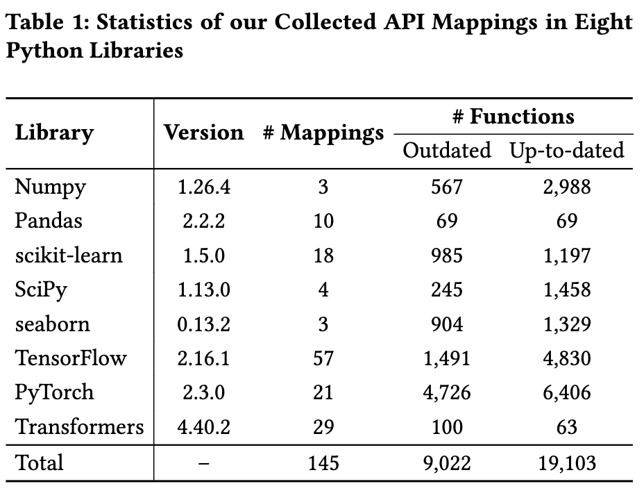

# Replication Package
This is the replication package for ASE submission #1438, titled *LLMs Meet Library Evolution: Evaluating Deprecated API Usage in LLM-based Code Completion*.

##
- `llm_dep`: the folder of source code for study and mitigation approaches
- All data and results are avaible at [figshare](https://figshare.com/s/e8de860d8fc2ec0541d2)


## Study Setup & Results

### Step 1: API Mapping Collection
The statistics of the collected 145 API mappings are presented Table 1. The detailed list of all API mappings can be found in [Appendix](#appendix).



### Step 2: Completion Prompt Construction
The line-level code completion prompts constructed from the *outdated* and *up-to-dated* functions can be found in [probing-inputs](https://figshare.com/s/e8de860d8fc2ec0541d2?file=47077525). Each sample is formated as a JSON dict, where 
- `function` is the original function 
- `alias dict` is the parsed API aliases
- `probing input` is the prompt input
- `deprecated api` and `replacement API` are the involved API mapping
- `category` is either *outdated* or *up-to-dated*
- `reference` is the ground-truth of the next line
The following is an example.

```json
{
        "function": "    def test_addsumprod(self):\n        # Tests add, sum, product.\n        (x, y, a10, m1, m2, xm, ym, z, zm, xf) = self.d\n        assert_equal(np.add.reduce(x), add.reduce(x))\n        assert_equal(np.add.accumulate(x), add.accumulate(x))\n        assert_equal(4, sum(array(4), axis=0))\n        assert_equal(4, sum(array(4), axis=0))\n        assert_equal(np.sum(x, axis=0), sum(x, axis=0))\n        assert_equal(np.sum(filled(xm, 0), axis=0), sum(xm, axis=0))\n        assert_equal(np.sum(x, 0), sum(x, 0))\n        assert_equal(np.product(x, axis=0), product(x, axis=0))\n        assert_equal(np.product(x, 0), product(x, 0))\n        assert_equal(np.product(filled(xm, 1), axis=0), product(xm, axis=0))\n        s = (3, 4)\n        x.shape = y.shape = xm.shape = ym.shape = s\n        if len(s) > 1:\n            assert_equal(np.concatenate((x, y), 1), concatenate((xm, ym), 1))\n            assert_equal(np.add.reduce(x, 1), add.reduce(x, 1))\n            assert_equal(np.sum(x, 1), sum(x, 1))\n            assert_equal(np.product(x, 1), product(x, 1))",
        "alias dict": {
            "np.cumprod": "numpy.cumprod",
            "np.all": "numpy.all",
            "np.round_": "numpy.round_",
            "np.prod": "numpy.prod",
            "np.sometrue": "numpy.sometrue",
            "np.cumproduct": "numpy.cumproduct",
            "np.any": "numpy.any",
            "np.product": "numpy.product",
            "np.round": "numpy.round",
            "np.alltrue": "numpy.alltrue",
            "np.sort": "numpy.sort",
            "np.msort": "numpy.msort"
        },
        "probing input": "    def test_addsumprod(self):\n        # Tests add, sum, product.\n        (x, y, a10, m1, m2, xm, ym, z, zm, xf) = self.d\n        assert_equal(np.add.reduce(x), add.reduce(x))\n        assert_equal(np.add.accumulate(x), add.accumulate(x))\n        assert_equal(4, sum(array(4), axis=0))\n        assert_equal(4, sum(array(4), axis=0))\n        assert_equal(np.sum(x, axis=0), sum(x, axis=0))\n        assert_equal(np.sum(filled(xm, 0), axis=0), sum(xm, axis=0))\n        assert_equal(np.sum(x, 0), sum(x, 0))\n",
        "deprecated api": [
            "numpy.product"
        ],
        "replacement api": "numpy.prod",
        "category": "outdated",
        "reference": "assert_equal(np.product(x,axis=0),product(x,axis=0))"
    },
```

### Step 3: LLM-based Code Completion
Run the scripts `llm_dep/probing/api_probing.py` (for open-source LLMs) and `llm_dep/probing/chatgpt_probing.py` (for gpt-3.5) to perform the LLM-based code completion. The scripts need 3 key arguments:
- `model`, the employed LLM: 
    - codegen-350m
    - codegen-2b
    - codegen-6b
    - deepseek-1.3b
    - starcoder-3b
    - codellama-7b
    - gpt-3.5 (used for `chatgpt_probing.py`)
- `lib`, subject library:
    - numpy
    - pandas
    - sklearn (i.e., scikit-learn)
    - scipy
    - seaborn
    - tensorflow
    - pytorch
    - transformers
- `maxlen`, max tokens to generate: 50 in our study.

The results in our paper can be found in [probing-results](https://figshare.com/s/e8de860d8fc2ec0541d2?file=47077528). Each sample is formated as a JSON dict, which is similar to those in prompts, with one additional result field `probing predictions`. 

The following is an example result, where `"        assert np.alltrue(a == np.array([0,1,2,3,4,5,6,7,8,9]))\n..."` is the LLM-generated completion, `["numpy.array", "numpy.alltrue"]` is the list of parsed APIs in the completion.
```json
"probing predictions": [
    [
        "        assert np.alltrue(a == np.array([0,1,2,3,4,5,6,7,8,9]))\n        assert np.alltrue(b == np.array([0,1",
        [
            "numpy.array",
            "numpy.alltrue"
        ]
    ]
]
```

Step 4: Completion Result Annotation
The annotation is performed during runing `llm_dep/probing/api_probing.py` and `llm_dep/probing/chatgpt_probing.py`. The statistics of the *good*, *bad*, and *irrelevant* completions can be found the log files in [probing-results](https://figshare.com/s/e8de860d8fc2ec0541d2?file=47077528).


## Mitigation Approaches
### Approach 1: ReplaceAPI
Run the script `llm_dep/fixing/replacing.py` (only for open-source LLMs). The script needs 3 key arguments:
- `model`, the employed LLM: 
    - codegen-350m
    - codegen-2b
    - codegen-6b
    - deepseek-1.3b
    - starcoder-3b
    - codellama-7b
    - gpt-3.5 (used for `chatgpt_probing.py`)
- `lib`, subject library:
    - numpy
    - pandas
    - sklearn (i.e., scikit-learn)
    - scipy
    - seaborn
    - tensorflow
    - pytorch
    - transformers
- `maxlen`, max tokens to generate: 50 in our study.

The results in our paper can be found in [fixing-results-replacing](https://figshare.com/s/e8de860d8fc2ec0541d2?file=47077519). Each sample is formated as a JSON dict, which is similar to those in probing-results, with one additional result field `replcing predictions`, which shares the same format with `probing predictions`.

The following is an example:
```json
"replacing predictions": [
    [
        "        assert np.alltrue(a == np.array([0,1,2,3,4,5,6,7,8,9]))\n        assert np.alltrue(b == np.array([0,1,2,3,",
        [
            "numpy.array",
            "numpy.alltrue"
        ]
    ]
]
```

### Approach 2: InsertPrompt
Run the scripts `llm_dep/fixing/prompting.py` (for open-source LLMs) and `llm_dep/fixing/chatgpt_prompting.py`  (for gpt-3.5). The scripts also need the same 3 key arguments. 

The results used in our paper can be found in [fixing-results-prompting](https://figshare.com/s/e8de860d8fc2ec0541d2?file=47077522). Each sample is formated as a JSON dict, which is similar to those in probing-results, with one additional result field `prompting predictions`, which shares the same format with `probing predictions`.

The following is an example:
```json
"prompting predictions": [
    [
        "\n        assert np.all(a == np.array([0,1,2,3,4,5,6,7,8,9]))",
        [
            "numpy.array",
            "numpy.all"
        ]
    ]
]
```


## <a name="appendix"></a>Appendix
#### [Numpy](https://numpy.org/) (# Mappings = 3)
| Deprecated API | Replacing API |
| -------------- | ------------- |
| numpy.alltrue | numpy.all |
| numpy.cumproduct | numpy.cumprod |
| numpy.product | numpy.prod |


#### [Pandas](https://pandas.pydata.org/) (# Mappings = 10)
| Deprecated API | Replacing API |
| -------------- | ------------- |
| pandas.DataFrame.applymap | pandas.DataFrame.map |
| pandas.DataFrame.first | pandas.DataFrame.loc |
| pandas.DataFrame.iteritems | pandas.DataFrame.items |
| pandas.DataFrame.last | pandas.DataFrame.loc |
| pandas.DataFrame.pad | pandas.DataFrame.ffill |
| pandas.DataFrame.select | pandas.DataFrame.loc |
| pandas.DataFrame.swapaxes | pandas.DataFrame.transpose |
| pandas.Series.iteritems | pandas.Series.items |
| pandas.Series.pad | pandas.Series.ffill |
| pandas.io.formats.style.Styler.render | pandas.io.formats.style.Styler.to_html |

#### [scikit-learn](https://scikit-learn.org/stable/) (# Mappings = 4)
| Deprecated API | Replacing API |
| -------------- | ------------- |
| sklearn.datasets.fetch_mldata | sklearn.datasets.fetch_openml |
| sklearn.metrics.jaccard_similarity_score | sklearn.metrics.jaccard_score |
| sklearn.mixture.GMM | sklearn.mixture.GaussianMixture |
| sklearn.preprocessing.Imputer | sklearn.impute.SimpleImputer |

#### [SciPy](https://scipy.org/) (# Mappings = 18)
| Deprecated API | Replacing API |
| -------------- | ------------- |
| scipy.integrate.cumtrapz | scipy.integrate.cumulative_trapezoid |
| scipy.integrate.simps | scipy.integrate.simpson |
| scipy.integrate.trapz | scipy.integrate.trapezoid |
| scipy.interpolate.interp2d | scipy.interpolate.bisplev |
| scipy.linalg.pinv2 | scipy.linalg.pinv |
| scipy.misc.comb | scipy.special.comb |
| scipy.misc.face | scipy.datasets.face |
| scipy.misc.factorial | scipy.special.factorial |
| scipy.misc.factorial2 | scipy.special.factorial2 |
| scipy.misc.logsumexp | scipy.special.logsumexp |
| scipy.signal.hanning | scipy.signal.windows.hann |
| scipy.special.errprint | scipy.special.seterr |
| scipy.special.sph_jn | scipy.special.spherical_jn |
| scipy.special.sph_yn | scipy.special.spherical_yn |
| scipy.stats.betai | scipy.special.betainc |
| scipy.stats.chisqprob | scipy.stats.chi2.sf |
| scipy.stats.itemfreq | scipy.stats.binned_statistic |
| scipy.stats.rvs_ratio_uniforms | scipy.stats.sampling.RatioUniforms |

#### [seaborn](https://seaborn.pydata.org/) (# Mappings = 3)
| Deprecated API | Replacing API |
| -------------- | ------------- |
| seaborn.despine | seaborn.utils.despine |
| seaborn.factorplot | seaborn.catplot |
| seaborn.tsplot | seaborn.lineplot |

#### [TensorFlow](https://www.tensorflow.org/) (# Mappings = 57)
| Deprecated API | Replacing API |
| -------------- | ------------- |
| tensorflow.Print | tensorflow.print |
| tensorflow.all_variables | tensorflow.global_variables |
| tensorflow.arg_max | tensorflow.math.argmax |
| tensorflow.arg_min | tensorflow.math.argmin |
| tensorflow.compat.v1.Print | tensorflow.print |
| tensorflow.compat.v1.all_variables | tensorflow.global_variables |
| tensorflow.compat.v1.arg_max | tensorflow.math.argmax |
| tensorflow.compat.v1.arg_min | tensorflow.math.argmin |
| tensorflow.compat.v1.div | tensorflow.divide |
| tensorflow.compat.v1.initialize_all_variables | tensorflow.global_variables_initializer |
| tensorflow.compat.v1.initializers.uniform_unit_scaling | tensorflow.initializers.variance_scaling |
| tensorflow.compat.v1.metrics.auc | tensorflow.keras.metrics.AUC |
| tensorflow.compat.v1.mixed_precision.DynamicLossScale | tensorflow.keras.mixed_precision.LossScaleOptimizer |
| tensorflow.compat.v1.mixed_precision.FixedLossScale | tensorflow.keras.mixed_precision.LossScaleOptimizer |
| tensorflow.compat.v1.mixed_precision.experimental.DynamicLossScale | tensorflow.keras.mixed_precision.LossScaleOptimizer |
| tensorflow.compat.v1.mixed_precision.experimental.FixedLossScale | tensorflow.keras.mixed_precision.LossScaleOptimizer |
| tensorflow.compat.v1.multinomial | tensorflow.random.categorical |
| tensorflow.compat.v1.random.multinomial | tensorflow.random.categorical |
| tensorflow.compat.v1.saved_model.load | tensorflow.saved_model.load |
| tensorflow.compat.v1.saved_model.loader.load | tensorflow.saved_model.load |
| tensorflow.compat.v1.sparse_to_dense | tensorflow.sparse.to_dense |
| tensorflow.compat.v1.substr | tensorflow.strings.substr |
| tensorflow.compat.v1.to_bfloat16 | tensorflow.cast |
| tensorflow.compat.v1.to_complex128 | tensorflow.cast |
| tensorflow.compat.v1.to_complex64 | tensorflow.cast |
| tensorflow.compat.v1.to_double | tensorflow.cast |
| tensorflow.compat.v1.to_float | tensorflow.cast |
| tensorflow.compat.v1.to_int32 | tensorflow.cast |
| tensorflow.compat.v1.to_int64 | tensorflow.cast |
| tensorflow.compat.v1.train.experimental.DynamicLossScale | tensorflow.keras.mixed_precision.LossScaleOptimizer |
| tensorflow.compat.v1.train.experimental.FixedLossScale | tensorflow.keras.mixed_precision.LossScaleOptimizer |
| tensorflow.compat.v1.uniform_unit_scaling_initializer | tensorflow.initializers.variance_scaling |
| tensorflow.config.experimental_run_functions_eagerly | tensorflow.config.run_functions_eagerly |
| tensorflow.distribute.experimental.MultiWorkerMirroredStrategy | tensorflow.distribute.MultiWorkerMirroredStrategy |
| tensorflow.div | tensorflow.divide |
| tensorflow.initialize_all_variables | tensorflow.global_variables_initializer |
| tensorflow.initializers.uniform_unit_scaling | tensorflow.initializers.variance_scaling |
| tensorflow.metrics.auc | tensorflow.keras.metrics.AUC |
| tensorflow.mixed_precision.DynamicLossScale | tensorflow.keras.mixed_precision.LossScaleOptimizer |
| tensorflow.mixed_precision.FixedLossScale | tensorflow.keras.mixed_precision.LossScaleOptimizer |
| tensorflow.mixed_precision.experimental.DynamicLossScale | tensorflow.keras.mixed_precision.LossScaleOptimizer |
| tensorflow.mixed_precision.experimental.FixedLossScale | tensorflow.keras.mixed_precision.LossScaleOptimizer |
| tensorflow.multinomial | tensorflow.random.categorical |
| tensorflow.random.multinomial | tensorflow.random.categorical |
| tensorflow.saved_model.loader.load | tensorflow.saved_model.load |
| tensorflow.sparse_to_dense | tensorflow.sparse.to_dense |
| tensorflow.substr | tensorflow.strings.substr |
| tensorflow.to_bfloat16 | tensorflow.cast |
| tensorflow.to_complex128 | tensorflow.cast |
| tensorflow.to_complex64 | tensorflow.cast |
| tensorflow.to_double | tensorflow.cast |
| tensorflow.to_float | tensorflow.cast |
| tensorflow.to_int32 | tensorflow.cast |
| tensorflow.to_int64 | tensorflow.cast |
| tensorflow.train.experimental.DynamicLossScale | tensorflow.keras.mixed_precision.LossScaleOptimizer |
| tensorflow.train.experimental.FixedLossScale | tensorflow.keras.mixed_precision.LossScaleOptimizer |
| tensorflow.uniform_unit_scaling_initializer | tensorflow.initializers.variance_scaling |


#### [PyTorch](https://pytorch.org/) (# Mappings = 21)
| Deprecated API | Replacing API |
| -------------- | ------------- |
| torch.btriunpack | torch.lu_unpack |
| torch.chain_matmul | torch.linalg.multi_dot |
| torch.cholesky | torch.linalg.cholesky |
| torch.eig | torch.linalg.eig |
| torch.lstsq | torch.linalg.lstsq |
| torch.lu | torch.linalg.lu_factor |
| torch.lu_solve | torch.linalg.lu_solve |
| torch.matrix_rank | torch.linalg.matrix_rank |
| torch.nn.functional.upsample | torch.nn.functional.interpolate |
| torch.nn.functional.upsample_bilinear | torch.nn.functional.interpolate |
| torch.nn.functional.upsample_nearest | torch.nn.functional.interpolate |
| torch.nn.modules.module.register_module_backward_hook | torch.nn.modules.module.register_module_full_backward_hook |
| torch.nn.utils.stateless.functional_call | torch.func.functional_call |
| torch.nn.utils.weight_norm | torch.nn.utils.parametrizations.weight_norm |
| torch.norm | torch.linalg.norm |
| torch.qr | torch.linalg.qr |
| torch.solve | torch.linalg.solve |
| torch.svd | torch.linalg.svd |
| torch.symeig | torch.linalg.eigh |
| torch.testing.assert_allclose | torch.testing.assert_close |
| torch.triangular_solve | torch.linalg.solve_triangular |


#### [Transformers](https://huggingface.co/docs/transformers/index) (# Mappings = 29)
| Deprecated API | Replacing API |
| -------------- | ------------- |
| transformers.BeitFeatureExtractor | transformers.BeitImageProcessor |
| transformers.ConditionalDetrFeatureExtractor | transformers.ConditionalDetrImageProcessor |
| transformers.ConvNextFeatureExtractor | transformers.ConvNextImageProcessor |
| transformers.DPTFeatureExtractor | transformers.DPTImageProcessor |
| transformers.DeformableDetrFeatureExtractor | transformers.DeformableDetrImageProcessor |
| transformers.DetrFeatureExtractor | transformers.DetrImageProcessor |
| transformers.DonutFeatureExtractor | transformers.DonutImageProcessor |
| transformers.GLPNFeatureExtractor | transformers.GLPNImageProcessor |
| transformers.HubertForCTC.freeze_feature_extractor | transformers.HubertForCTC.freeze_feature_encoder |
| transformers.LayoutLMv2FeatureExtractor | transformers.LayoutLMv2ImageProcessor |
| transformers.MaskFormerFeatureExtractor | transformers.MaskFormerImageProcessor |
| transformers.MobileNetV1FeatureExtractor | transformers.MobileNetV1ImageProcessor |
| transformers.MobileViTFeatureExtractor | transformers.MobileViTImageProcessor |
| transformers.OwlViTFeatureExtractor | transformers.OwlViTImageProcessor |
| transformers.PerceiverFeatureExtractor | transformers.PerceiverImageProcessor |
| transformers.PoolFormerFeatureExtractor | transformers.PoolFormerImageProcessor |
| transformers.SEWDForCTC.freeze_feature_extractor | transformers.SEWDForCTC.freeze_feature_encoder |
| transformers.SEWForCTC.freeze_feature_extractor | transformers.SEWForCTC.freeze_feature_encoder |
| transformers.SEWForSequenceClassification.freeze_feature_extractor | transformers.SEWForCTC.freeze_feature_encoder |
| transformers.SegformerFeatureExtractor | transformers.SegformerImageProcessor |
| transformers.TFHubertForCTC.freeze_feature_extractor | transformers.TFHubertForCTC.freeze_feature_encoder |
| transformers.TFWav2Vec2ForCTC.freeze_feature_extractor | transformers.TFWav2Vec2ForCTC.freeze_feature_encoder |
| transformers.UniSpeechForCTC.freeze_feature_extractor | transformers.UniSpeechForCTC.freeze_feature_encoder |
| transformers.UniSpeechSatForCTC.freeze_feature_extractor | transformers.UniSpeechSatForCTC.freeze_feature_encoder |
| transformers.ViTFeatureExtractor | transformers.ViTImageProcessor |
| transformers.VideoMAEFeatureExtractor | transformers.VideoMAEImageProcessor |
| transformers.Wav2Vec2ForCTC.freeze_feature_extractor | transformers.Wav2Vec2ForCTC.freeze_feature_encoder |
| transformers.WavLMForCTC.freeze_feature_extractor | transformers.WavLMForCTC.freeze_feature_encoder |
| transformers.YolosFeatureExtractor | transformers.YolosImageProcessor |